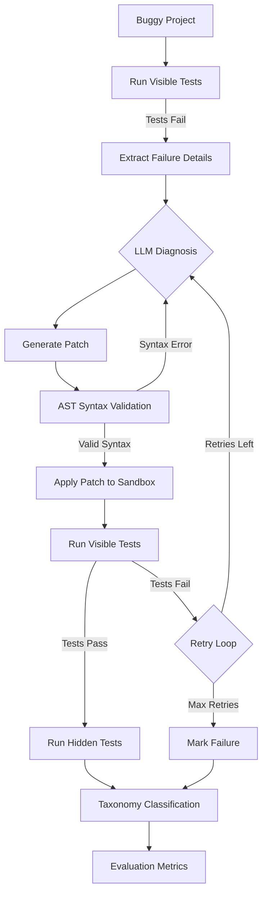

# Aegis-Lite


## Overview
Aegis-Lite is an LLM-based, test-guided Python program repair system designed to evaluate how reliably Large Language Models (LLMs) can fix real bugs. It automates the process of diagnosing failures, applying patches, and validating repairs through sandboxed testing, allowing developers to rigorously assess different models on automated program repair.

## Key Features
* **Automated Repair Pipeline**: End-to-end orchestration from bug detection to validated fix.
* **Test-Guided Feedback**: Iterative repair loop using visible test failures to guide the LLM.
* **Generalization Checking**: Validation of fixes against hidden test suites to detect test overfitting.
* **Taxonomy Classification**: Detailed categorization of failure modes (e.g., wrong diagnosis, incomplete repair, regression).
* **Sandboxed Execution**: Secure testing environments using Docker to safely execute untrusted AI-generated code.
* **Extensible Architecture**: Easy integration with different LLM providers (Gemini built-in, mock provider for testing).
* **Robust Evaluation**: Comprehensive metrics including Pass@1, Pass@3, and visible/hidden pass rates.

## Architecture



## Quick Start

### Installation
```bash
git clone <repository-url>
cd aegis-lite
pip install -e .
```

### API Key Setup
Get an API key from Google AI Studio or your preferred provider.
```bash
cp .env.example .env
# Edit .env and add your API key
```

### Running a Repair
```bash
python -m aegis.cli repair --project-dir examples/sample_project
```

## Usage

Aegis-Lite provides a CLI for running repairs and evaluations.

* **Single repair**:
  ```bash
  python -m aegis.cli repair --project-dir examples/sample_project
  ```
* **Full evaluation**:
  ```bash
  python -m aegis.cli evaluate --benchmark benchmarks/dev --output reports/
  ```
* **Validate syntax**:
  ```bash
  python -m aegis.cli validate --file mycode.py
  ```
* **List benchmark**:
  ```bash
  python -m aegis.cli benchmark --dir benchmarks/dev
  ```

## Project Structure
```
aegis-lite/
├── aegis/                 # Core package
│   ├── runner.py          # Test execution
│   ├── config.py          # Configuration management
│   ├── validator.py       # AST and syntax validation
│   ├── taxonomy.py        # Failure classification
│   ├── llm.py             # LLM provider integration
│   ├── patcher.py         # Code manipulation and patching
│   ├── sandbox.py         # Docker sandbox integration
│   ├── repair.py          # Repair loop orchestration
│   ├── benchmark.py       # Benchmark loading
│   ├── evaluation.py      # Metrics and reporting
│   └── cli.py             # Command-line interface
├── benchmarks/            # Benchmark datasets
├── configs/               # Configuration files
├── reports/               # Evaluation reports output
└── tests/                 # Unit tests for Aegis-Lite
```

## How It Works
1. **Initial Assessment**: Runs the buggy project's visible test suite to establish a baseline and extract failure details.
2. **LLM Diagnosis**: Feeds the source code, test output, and context to the LLM to diagnose the issue.
3. **Patch Generation**: The LLM generates a proposed fix formatted as a structured patch.
4. **Validation**: Validates the patch against python AST rules (e.g., ensuring no syntax errors or illegal test modifications).
5. **Sandboxed Testing**: Safely applies the patch in an isolated environment and re-runs the visible tests.
6. **Iterative Feedback**: If the fix fails, the error output is fed back into the LLM for another attempt (up to `max_retries`).
7. **Hidden Evaluation**: Once visible tests pass, hidden tests are run to verify the robustness of the fix.
8. **Classification & Metrics**: Categorizes the outcome and computes evaluation metrics.

## Evaluation Metrics
* **Pass@1**: Percentage of bugs successfully fixed on the first attempt.
* **Pass@3**: Percentage of bugs fixed within 3 attempts.
* **Visible Pass Rate**: Percentage of attempts that pass the visible test suite.
* **Hidden Pass Rate**: Percentage of attempts that pass the hidden test suite (measuring generalization).
* **Failure Taxonomy**: Detailed breakdown of why repairs fail (e.g., Invalid Python, Test Overfitting, Regression).

## Development Benchmark
The `benchmarks/dev` directory contains a curated set of 15 built-in bugs designed for testing and development of the system. Each bug includes buggy source code, visible tests, hidden tests, and metadata defining the difficulty and bug category.

## Configuration
Aegis-Lite uses JSON configuration files (e.g., `configs/default.json`) and environment variables. Settings include model selection, timeouts, retry limits, and sandbox options.

## Docker Sandbox
To safely execute AI-generated code, Aegis-Lite supports sandboxed testing using Docker.
1. Ensure Docker is installed and running.
2. Build the sandbox image: `docker build -t aegis-sandbox:latest .`
3. Enable sandboxing in your config: `"sandbox_enabled": true`.

## Model Comparison
You can compare different models by configuring multiple providers or tweaking the `model` setting in your config JSON. Evaluation reports output detailed metrics that allow side-by-side comparison of different LLM architectures and prompting strategies.

## Design Decisions
* **AST Validation before Execution**: Ensures that blatantly broken code never hits the sandbox, saving time and resources.
* **Separation of Visible/Hidden Tests**: Prevents LLMs from overfitting to the provided test suite, providing a more realistic assessment of repair capability.
* **Whole-File Replacement Patches**: Simplifies parsing and application compared to complex diff formats which LLMs often struggle to format correctly.
* **Mock Provider**: Enables fast, deterministic unit testing of the infrastructure without relying on costly API calls.

## Limitations
* **Single-File Bugs**: The current architecture is optimized for bugs contained within a single file. Multi-file repairs are significantly more complex and harder to orchestrate.
* **Benchmark Contamination**: Because LLMs are trained on vast amounts of public code, they may have seen the benchmarks during training.
* **Docker Overhead**: Using the sandbox introduces execution overhead for each test run.

## License
MIT License.

## Author
[Student Name]
